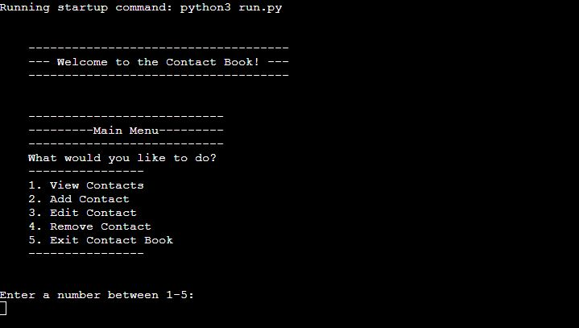
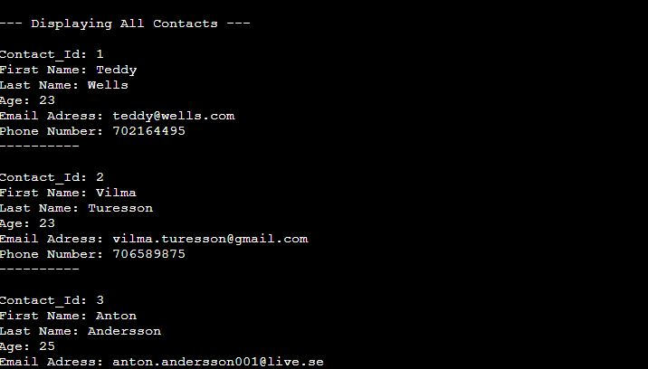
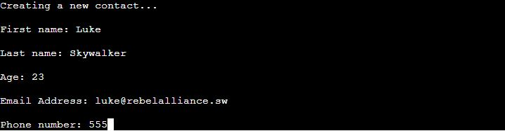
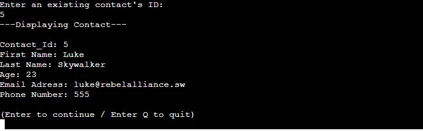
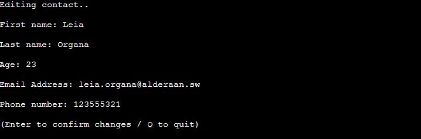
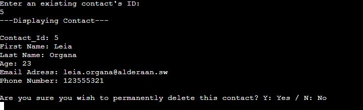
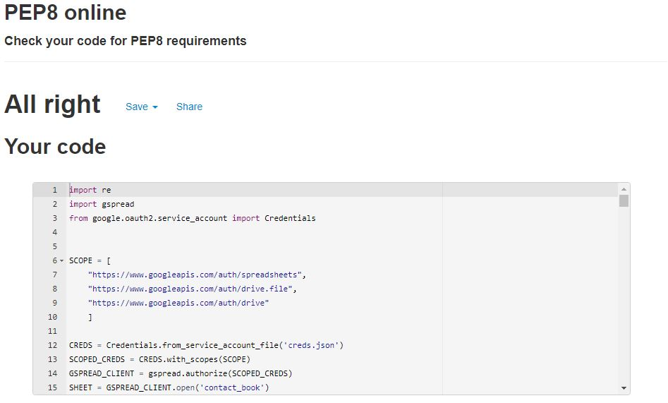

# Contact Book
A terminal based application developed using python aimed at providing the user with an intuitive way of viewing, storing and updating
contact information in google spreadsheet.

# Content
* [UX](#ux)
  * [User Stories](#user-stories)
  * [Site Owner Goals](#site-owner-goals)
* [Features](#features)
  * [Existing Features](#existing-features)
  * [Future additions](#future-additions)
* [Technologies Used](#technologies-used)
  * [Language](#language)
  * [Tools](#tools)
  * [Libraries](#libraries)
* [Testing](#testing)
  * [Validation](#validation)
  * [Bugs](#bugs)
* [Deployment](#deployment)
  * [Deployment steps](#deployment-steps)
* [Credits](#credits)

# UX
## User Stories
- As a user I want a menu that's easy to navigate through.
- As a user I want clear feedback on interactions with the application.
- As a user I want to be able to add new contacts.
- As a user I want to be able to view all stored contacts.
- As a user I want to be able to update existing contacts.
- As a user I want to be able to delete a specific user.

## Site Owner Goals
- As a site owner I want my functions to be dynamically applicable.
- As a site owner I want validation to ensure the correct data is inputted.
- As a site owner I want to make sure it's easy to add additional down the line. 

# Features
## Existing Features
* Main Menu
  * When application is run it will welcome the user and present them with a menu consisting of 5 different options. Whenever an action has been completed or otherwise     cancelled by the user, they will return to this menu.
 
 
* View all contacts
  * Choosing this option will present a list of all stored contacts.
  * All contacts will be presented with the following information: First Name, Last Name, Age, E-mail Address & Phone Number alongside an ID that's automatically given
    on creation.
  * The user can press enter to continue to the main menu from here.
 
 
* Create new contact
  * When choosing this option the user will be asked to enter all necessary information. Starting with the name, followed by an age, E-mail address and a phone number.
  * The application will check if the user input is valid in relation to the requested information. Should validation fail, the user will be asked to provide the           information again.
  * Upon creation the new contact will automatically be given a unique contact id.
  * When the contact has been created, the user gets confirmation on the contact being created and then be redirected to the main menu.
 
 
* Edit contact
  * This option will ask the user to provide the id of the contact that the user wishes to edit.
  * If no ID is provided or the ID doesn't match any of the existing contacts. All existing contacts will be presented for reference.
  * If an existing ID is provided, the matched contact will be displayed. The user will have the option to proceed with editing the contact or cancelling.
  
  * If the user continues the application will, much like contact creation, prompt the user to input all necessary information. 
  * Finally when all information has been provided, the application will once again ask the user to confirm the changes. If cancelled, none of the changes will apply       and the user will return to the main menu.
 
 
* Delete contact
  * If chosen the user will be asked to provide the ID of the contact they wish to remove.
  * If none or unmtached ID is provided, all contacts will be displayed.
  * If matching ID is provided, the corresponding contact will be displayed and a message will require the user to confirm the deletion by either entering "Y" for Yes     or "N" for No. Either of these options will return the user to the main menu.
 
 
* Exit program
  * Simply an option to exit the application.

## Future additions
* Search Contact
  * Being able to search contacts using either the name, email address or phone number. This could in turn make the Edit och Delete functionality easier to use.
* Edit single line
  * Being able to edit only the requested information without having to edit the entire contact. This would alleviate some unecessary changes made to a contact.

# Technologies Used
## Language
* Python3 - Raw Python code was used for this project.

## Tools
* [Google sheets](https://www.google.com/sheets/about/) - Google Sheets was used to store the data.

## Libraries
- [Gspread](https://docs.gspread.org/en/latest/) - CRUD functionality to store data.
- [Re](https://docs.python.org/3/library/re.html) - Validation of user input

## Validation
PEP8 Validator returned 0 issues.

## Testing
- Initially the intention was to create the application using a OOP approach. This would have been easier if the data was stored locally in a seperate file. However when trying to create and update data with the Gspread library i ran in to multiple issues regarding object data types not being accepted by the Gspread methods provided. To remedy this I had to destructure my contact objects in to lists and vice versa. So to avoid any unecessary hurdles I switched approach.
  
## Bugs
* <strong>Problem</strong> 🐞: Application on Heroku returned a 404 Error.
* <strong>Cause</strong>🛠: Python Essentials Template files were missing since project was created without it.
* <strong>Resolution</strong>✅: Manually added all files and folders included in the Code Institute Python Template.

# Deployment
The project was deployed to Heroku.

## Deployment Steps
1. Log in to Heroku
2. Create a Project
3. Add buildpacks Python & Node.js
4. Add Config Vars: Key: PORT, Value: 8000
5. Go to deployment tab
6. Link GitHub account with Heroku project
7. Select GitHub repository
8. Click on Deploy Branch
9. Automatic deployments applied.
10. Application accessible via following link - https://contact-storage.herokuapp.com/

## Credits 
Credit goes to my mentor Richard Wells for inspiration of possible functionality and good markdown best practices.

